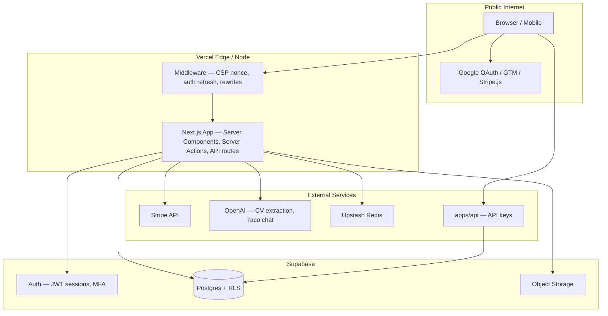

# Provenance Security Architecture

This document describes the security architecture, trust boundaries, and accepted risks for the Provenance platform. It is intended to satisfy ASVS V1 (architecture and threat-model documentation) and to guide security reviews, CASA assessments, and incident response.

**Last updated:** July 2026

---

## 1. System overview

Provenance is a multi-tenant SaaS platform for verified provenance records, artist/gallery profiles, subscriptions, and public asset verification. The production stack consists of:

| Component | Role | Deployment |
|-----------|------|------------|
| **Main web app** (`src/`) | Next.js 15 App Router — UI, server actions, API routes | Vercel |
| **Supabase** | Auth (email + OAuth), Postgres, Row Level Security (RLS), Storage | Supabase Cloud |
| **Stripe** | Subscriptions and billing (no card data stored in-app) | Stripe |
| **apps/api** | REST API for asset verification, certificates, webhooks (API-key auth) | Separate deployment |
| **Upstash Redis** | Distributed rate limiting (optional; in-memory fallback when unconfigured) | Upstash |
| **Google Tag Manager** | Analytics and ads (Consent Mode v2) | Third-party |

Planet subdomains (e.g. `collc.provenance.guru` → collectibles) and creator-site subdomains (`<handle>.provenance.app`) are served from the same Next.js deployment via middleware rewrites.

---

## 2. Trust boundaries

**Trust assumptions:**

- **Browser** is untrusted. All authorization is enforced server-side (RLS, `requireAdmin()`, session checks).
- **Supabase service role** is highly trusted and used only in server-side code paths that cannot rely on user RLS alone (admin storage, some migrations, background writes).
- **Stripe** is the system of record for payment instruments; the app stores only Stripe customer/subscription IDs.
- **API keys** (`apps/api`) are long-lived secrets scoped by planet and permission; they must never be exposed to browsers.

---

## 3. Data classification

| Category | Examples | Storage | Controls |
|----------|----------|---------|----------|
| **Authentication credentials** | Password hashes, MFA TOTP secrets | Supabase Auth | Managed by Supabase; MFA via TOTP |
| **PII — account** | Name, email, phone, address | `accounts`, `user_profiles` | RLS; user can read/write own data |
| **PII — Google OAuth** | Email, name, avatar from Google Sign-In | `auth.users` metadata | Limited Use; see Privacy Policy |
| **PII — contacts** | Gallery/artist contact lists | `contacts` | RLS scoped to profile owner |
| **Payment metadata** | Stripe customer ID, subscription status | `subscriptions` | No PAN/CVV; Stripe-hosted checkout |
| **Public content** | Artwork images, certificates, public profiles | Storage + Postgres | Public read where published; write gated by RLS |
| **Admin flags** | `accounts.public_data.admin` | Postgres | Protected by trigger (`20260708000004_protect_admin_flag.sql`); only service role can set |
| **API secrets** | `EMAIL_API_SECRET`, service role key, Upstash tokens | Environment variables | Never committed; Vercel secrets |

---

## 4. Authentication and session model

### End users

- **Supabase Auth** issues JWT-based sessions stored in HTTP-only cookies (via `@kit/supabase`).
- **OAuth:** Google Sign-In only (`openid`, `email`, `profile`). No Gmail/Drive/Calendar scopes.
- **MFA:** TOTP enrollment available in Settings → Security. Users can optionally enable step-up MFA.
- **Middleware** refreshes the session on each page request via `supabase.auth.getUser()`.

### Administrators

- Admin status: `accounts.public_data.admin === true`.
- **Page access:** `requireAdmin()` in `src/lib/admin.ts` — redirects unauthenticated users to sign-in, non-admins to home.
- **MFA enforcement:**
  - Admins with enrolled MFA factors who have not completed step-up this session (`aal1` when `aal2` required) are redirected to `/auth/verify`.
  - Admins with **no** MFA enrolled are allowed through (to avoid locking out the sole admin) but see a persistent banner linking to `/settings#security`.
- **API routes:** `requireAdminApi()` returns 401/403 JSON errors; blocks `aal1` sessions when `aal2` is required.
- **Server actions:** Shared `requireAdminUser()` / `requireAdminUserId()` helpers enforce the same MFA rules.

### Password reset (ASVS V2.5 / CASA 2.x)

The forgot-password flow for email/password accounts:

1. **Request** (`/auth/password-reset`): calls `supabase.auth.resetPasswordForEmail`. Supabase returns success for both existing and non-existing emails so the response never reveals whether an account exists (anti-enumeration, ASVS V2.5.6).
2. **Token delivery**: Supabase sends a short-lived, single-use OTP token via email using the `Reset password` template. The link points to:
   `{SiteURL}/auth/confirm?token_hash={token}&type=recovery&next=/update-password`
3. **Verification** (`/auth/confirm`): calls `supabase.auth.verifyOtp({ type: 'recovery', token_hash })`, which sets a new session cookie and redirects to `/update-password`. Expired or already-used tokens redirect to `/auth/callback/error`.
4. **Set new password** (`/update-password`): server-gated; redirects to `/auth/sign-in` if there is no active session. On submit, calls `supabase.auth.updateUser({ password })`. Validated against `RefinedPasswordSchema` (minimum 8 characters; additional requirements enabled via env vars — see `.env.example`).

**Open-redirect protection (CASA 5.1.2):** the `next` parameter in the confirm route is validated against same-origin rules before use.

**Password strength knobs** (off by default; toggle via `.env.example`):
- `NEXT_PUBLIC_PASSWORD_REQUIRE_SPECIAL_CHARS`
- `NEXT_PUBLIC_PASSWORD_REQUIRE_NUMBERS`
- `NEXT_PUBLIC_PASSWORD_REQUIRE_UPPERCASE`

**Rate limiting:** Supabase applies server-side rate limits on `resetPasswordForEmail`. No additional app-level rate limit is applied to the request form (captcha optional via `NEXT_PUBLIC_CAPTCHA_SITE_KEY`).

### apps/api

- **API key authentication** via `Authorization: Bearer <key>` header.
- Keys are hashed at rest; scopes (`read`, `write`, etc.) and optional planet scoping enforced per route.
- Per-key hourly rate limits (in-memory; resets on cold start).

---

## 5. Authorization (RLS)

All user-facing database access goes through Supabase clients with the user's JWT. Row Level Security policies enforce:

- Users can only modify their own accounts, profiles, and artworks.
- Gallery membership and role checks gate collaborative features.
- Public read policies expose only published/published-at content.
- Admin operations that bypass RLS use the service-role client only in explicitly audited server paths.

The admin flag cannot be self-assigned: a database trigger blocks non–service-role updates to `public_data.admin`.

---

## 6. Content Security Policy (CSP)

CSP is applied in `src/middleware.ts` for all HTML responses (main app, creator-site rewrites, and planet subdomain rewrites).

| Directive | Policy | Rationale |
|-----------|--------|-----------|
| `script-src` | `'self' 'nonce-<per-request>' 'strict-dynamic'` + GTM hosts | Nonce-based; no `'unsafe-inline'` for scripts |
| `script-src` eval | Omitted by default | No app code uses `eval()`. Set `NEXT_PUBLIC_CSP_ALLOW_EVAL=1` if a GTM tag requires it during container audit. |
| `style-src` | `'unsafe-inline'` **accepted exception** | React inline `style={{}}` cannot be nonce'd and is pervasive. Inline styles cannot execute script. |
| `frame-ancestors` | `'none'` (or `'self'` on preview routes) | Clickjacking protection |

The per-request nonce is forwarded via the `x-nonce` header to Server Components and passed to `GoogleTagManager` and Next.js inline bootstrap scripts.

API routes (`/api/*`) receive security headers via `next.config.ts` `headers()` (separate from middleware CSP).

---

## 7. Rate limiting

| Surface | Mechanism | Fallback |
|---------|-----------|----------|
| Public search endpoints | Upstash sliding window | In-memory per-process Map |
| Authenticated routes (Taco, etc.) | Per-user limits | In-memory |
| apps/api | Per API key, hourly | In-memory |

**Accepted risk:** When `UPSTASH_REDIS_REST_URL` / `UPSTASH_REDIS_REST_TOKEN` are not configured, rate limits are per-process and do not survive cold starts or scale horizontally. Production deployments should configure Upstash.

---

## 8. File upload validation

Upload paths validate files using magic-byte sniffing (`file-type` via `src/lib/file-signature.ts`):

| Path | Allowed types | Notes |
|------|---------------|-------|
| Artwork images | JPEG, PNG, WebP, GIF, HEIC | Normalized to JPEG via `sharp`/`heic-convert`; rejected if re-encode fails |
| Profile pictures | Images | 5 MB limit |
| Artist CVs | PDF, DOCX, plain text, CSV | 10 MB limit |
| Open-call submissions | Images | MIME + signature gate (previously had no validation) |

Declared MIME types are cross-checked against detected magic bytes when detection succeeds.

### VirusTotal hash-lookup (AV scanning)

Every upload path runs a SHA-256 hash lookup against the [VirusTotal v3 API](https://developers.virustotal.com/reference/files-1) before storing bytes. The free tier provides 500 lookups/day and 4/min.

- Implemented in `src/lib/file-signature.ts` → `vtCheckFile()` / `assertAllowedFileWithAv()`
- Known-malicious files (≥3 engines flagging) are rejected before upload to Supabase Storage
- Unknown hashes (novel files) are **allowed** (fail-open) — magic-byte validation still runs
- If `VIRUSTOTAL_API_KEY` is absent or VT is unreachable, scanning is skipped and the upload proceeds (fail-open to prevent availability impact)

**Accepted limitation:** Only catches known malware whose hash is in VT's database. Novel or custom malware won't be blocked at this layer.

---

## 9. Dependency and supply-chain security

- **CI:** `.github/workflows/security.yml` runs `pnpm audit --prod --audit-level=high` on push, PR, and weekly schedule.
- **Diff-scoped quality gates:** ESLint and TypeScript checks run only on changed `src/**/*.ts(x)` files in PRs and pushes, preventing new errors without requiring full baseline remediation.
- **Source maps:** Disabled in production (`productionBrowserSourceMaps: false`).

---

## 10. Known accepted risks and remediation plan

### 10.1 TypeScript / ESLint technical debt

| Metric | Baseline (July 2026) | Status |
|--------|----------------------|--------|
| TypeScript errors (`src/`) | ~660 across ~168 files | Tracked, not yet remediated |
| ESLint errors | ~1 473 | Tracked, not yet remediated |
| Build config | `ignoreBuildErrors: true`, `ignoreDuringBuilds: true` | Prevents deploy blocks |

**Mitigations in place:**

- Dead legacy scaffolds (`makerkit/.../apps/web`, `apps/provenance`, `apps/e2e`) excluded from root `tsconfig.json`.
- CI diff-scoped `tsc` and `eslint` on changed files.

**Follow-up (separate effort):** Burn down baseline errors incrementally, then flip `next.config.ts` flags to `false`.

### 10.2 CSP `style-src 'unsafe-inline'`

Required for React inline styles. Low risk — styles cannot execute JavaScript.

### 10.3 In-memory rate limiting fallback

See §7. Configure Upstash in production.

### 10.4 GTM third-party scripts

GTM may load tags that use `eval()` or additional origins. Monitor browser console for CSP violations post-deploy; use `NEXT_PUBLIC_CSP_ALLOW_EVAL=1` only if a specific tag requires it.

### 10.5 apps/api in-memory rate limits

API key rate limits reset on serverless cold starts. Acceptable for current traffic; migrate to Upstash if abuse is observed.

---

## 11. Security headers summary

Applied via middleware (HTML) and `next.config.ts` (API):

- `Strict-Transport-Security` (production HTTPS)
- `X-Content-Type-Options: nosniff`
- `Referrer-Policy: strict-origin-when-cross-origin`
- `Permissions-Policy` (camera, microphone, geolocation restrictions)
- `X-Frame-Options: DENY` (or `SAMEORIGIN` on preview)
- `Content-Security-Policy` (see §6)

---

## 12. Incident and vulnerability reporting

If you discover a security vulnerability in Provenance:

1. **Do not** open a public GitHub issue.
2. Email **privacy@provenance.guru** with:
   - Description of the vulnerability
   - Steps to reproduce
   - Potential impact assessment
   - Your contact information (optional, for follow-up)

We aim to acknowledge reports within **5 business days** and provide a remediation timeline for confirmed issues.

For general privacy inquiries, see the in-app Privacy Policy.

---

## 13. Related files

| Area | Location |
|------|----------|
| Middleware / CSP | `src/middleware.ts` |
| Admin auth + MFA | `src/lib/admin.ts` |
| Rate limiting | `src/lib/rate-limit.ts` |
| File signature validation | `src/lib/file-signature.ts` |
| API key auth | `apps/api/src/middleware/auth.ts` |
| Security CI | `.github/workflows/security.yml` |
| Admin flag protection | `makerkit/.../migrations/20260708000004_protect_admin_flag.sql` |
| Legal / privacy | `src/lib/legal/` |
