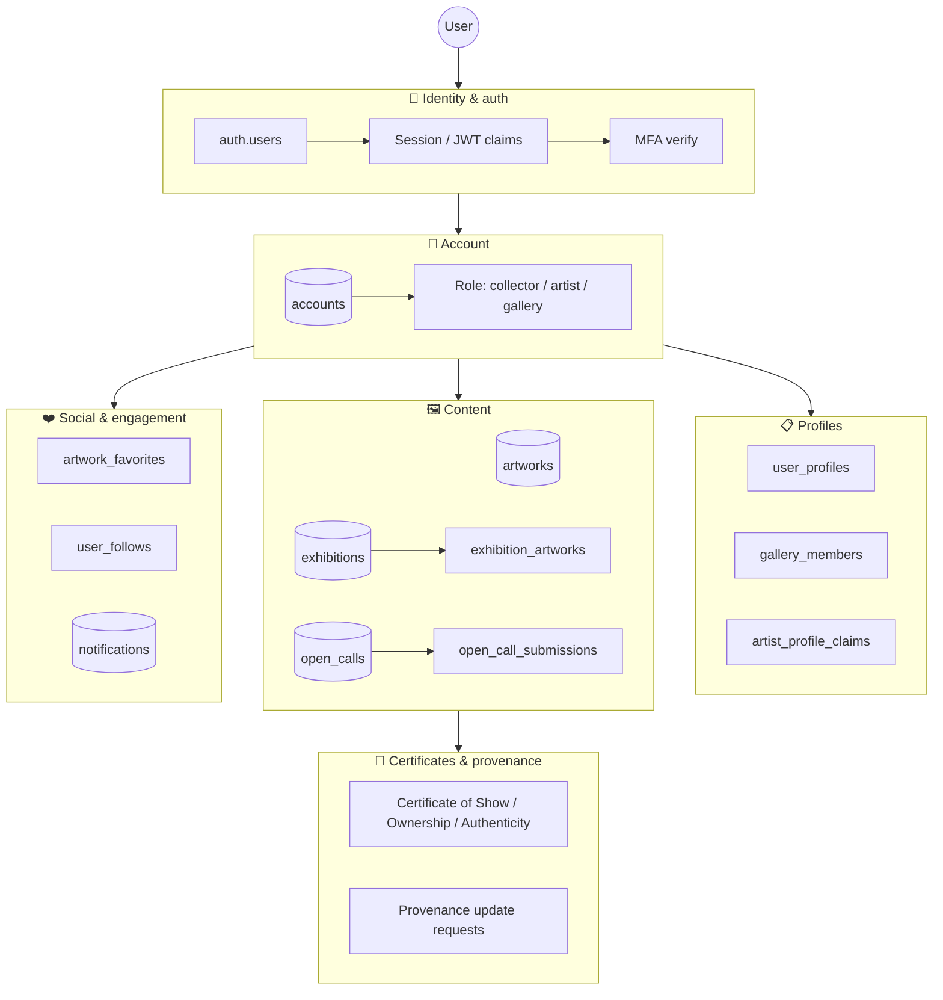
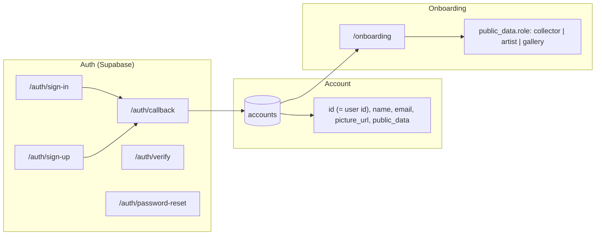
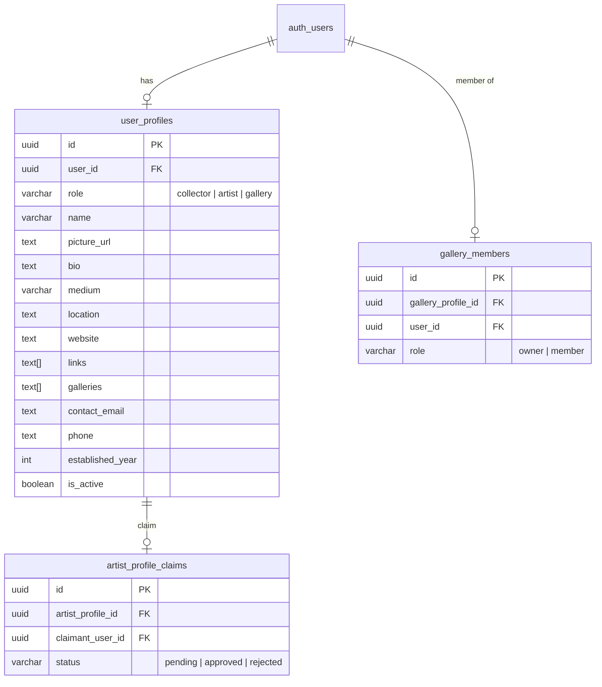
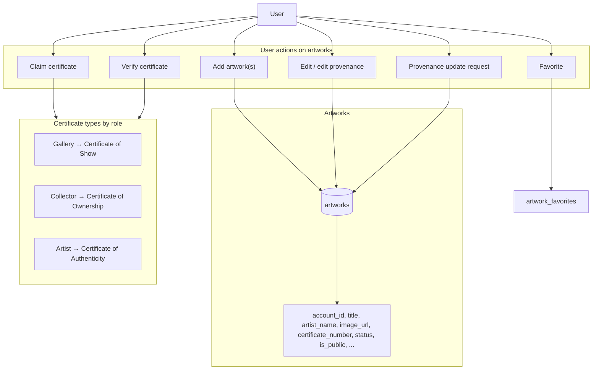
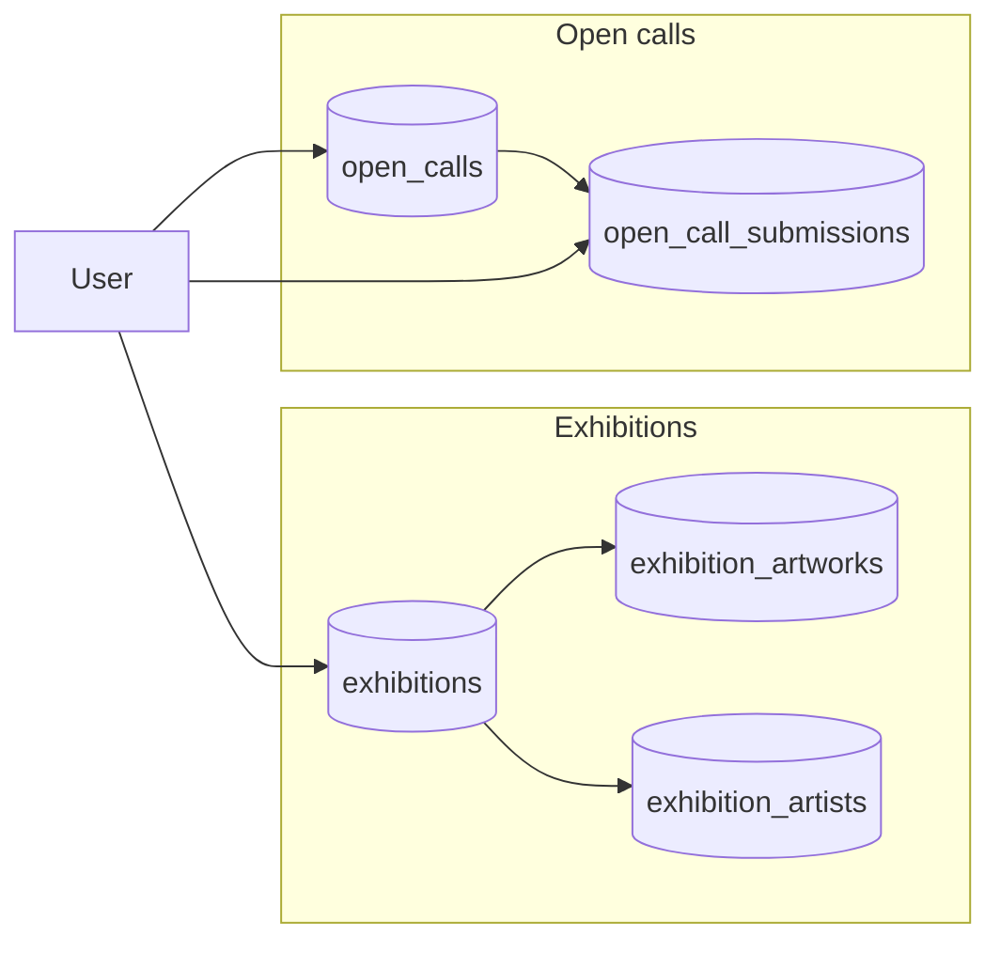
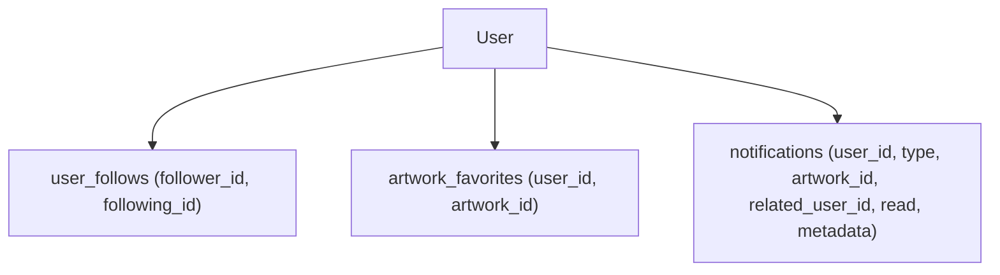

# User & Data Model Diagram — Provenance

This diagram shows what the **user** touches in the Provenance codebase: auth, account, profiles, artworks, exhibitions, social features, and app routes.

---

## 1. High-level: What the user uses

---

## 2. Auth & account flow

- **auth.users**: Supabase auth (email/password, OAuth, etc.).
- **accounts**: One row per user (`id` = `auth.users.id`). `public_data` holds `role` (and optionally `medium`, `links`, `galleries`).
- **Onboarding**: If `accounts.public_data.role` is missing, user is sent to `/onboarding` to pick a role.

---

## 3. User profiles (per-role)

- **user_profiles**: One profile per (user, role). Roles: collector, artist, gallery.
- **gallery_members**: Links a user to a gallery profile (owner/member).
- **artist_profile_claims**: Lets a user claim an artist profile (pending/approved/rejected).

Relevant routes: `/profiles`, `/profiles/new`, `/profiles/[id]/edit`, `/profiles/claims`.

---

## 4. Artworks & certificates

- **artworks**: Owned by `account_id`; have status (e.g. verified), visibility (`is_public`), and certificate workflow.
- **artwork_favorites**: `(user_id, artwork_id)` for “favorite” actions.
- Certificates: type depends on poster role (gallery / collector / artist) — see `src/lib/user-roles.ts`.

Routes: `/artworks`, `/artworks/add`, `/artworks/my`, `/artworks/[id]/edit`, `/artworks/[id]/certificate`, `/artworks/edit-provenance`, `/artworks/tags`.

---

## 5. Exhibitions & open calls

- **exhibitions**: Created by gallery account; linked to artworks and artists via `exhibition_artworks` and `exhibition_artists`.
- **open_calls** / **open_call_submissions**: User submits to open calls; submissions tied to user.

Routes: `/exhibitions`, `/exhibitions/new`, `/exhibitions/[id]`, `/exhibitions/[id]/edit`; `/open-calls`, `/open-calls/[slug]`.

---

## 6. Social & notifications

- **user_follows**: Who follows whom (e.g. follow artist/gallery profiles).
- **artwork_favorites**: Which artworks a user has favorited.
- **notifications**: In-app notifications (e.g. certificate claim, verify, favorites) — keyed by `user_id`.

Routes: `/notifications`; follow/favorite actions from artwork and profile UIs.

---

## 7. Main app routes (user-facing)

| Area | Routes |
|------|--------|
| **Auth** | `/auth/sign-in`, `/auth/sign-up`, `/auth/callback`, `/auth/verify`, `/auth/password-reset` |
| **Onboarding** | `/onboarding` |
| **Dashboard** | `/portal` |
| **Profile & settings** | `/profile`, `/settings`, `/profiles`, `/profiles/new`, `/profiles/[id]/edit`, `/profiles/claims` |
| **Artworks** | `/artworks`, `/artworks/add`, `/artworks/my`, `/artworks/[id]/edit`, `/artworks/[id]/certificate`, `/artworks/edit-provenance`, `/artworks/tags` |
| **Exhibitions** | `/exhibitions`, `/exhibitions/new`, `/exhibitions/[id]`, `/exhibitions/[id]/edit` |
| **Open calls** | `/open-calls`, `/open-calls/[slug]` |
| **Discovery** | `/registry`, `/artists`, `/artists/[id]`, `/gallery/[name]` |
| **Other** | `/notifications`, `/pitch`, `/collectibles`, `/articles`, `/about` |
| **Admin** | `/admin`, `/admin/queued-artworks`, `/admin/pitch`, `/admin/about` |

---

## 8. Hooks & server-side user access

- **useCurrentUser** (`src/hooks/use-current-user.ts`): Client hook for current user from JWT claims.
- **requireUser** (Makerkit): Server-side require session; redirects to sign-in or MFA verify.
- **OnboardingGuard** (`src/components/onboarding-guard.tsx`): Redirects to `/onboarding` if `accounts.public_data.role` is missing (with allowed paths for auth, about, artworks/add).
- **getUserProfiles** (`src/app/profiles/_actions/get-user-profiles.ts`): Loads all `user_profiles` for the current user.

---

## Summary: Data the user “uses”

| Layer | Tables / concepts |
|-------|-------------------|
| **Auth** | `auth.users`, session, JWT claims, MFA |
| **Account** | `accounts` (id, name, email, picture_url, public_data.role, etc.) |
| **Profiles** | `user_profiles`, `gallery_members`, `artist_profile_claims` |
| **Content** | `artworks`, `exhibitions`, `exhibition_artworks`, `exhibition_artists`, `open_calls`, `open_call_submissions` |
| **Engagement** | `artwork_favorites`, `user_follows`, `notifications` |
| **Workflows** | Certificates (Show / Ownership / Authenticity), provenance update requests |

All of the above are tied to the user via `auth.users.id` (or `account_id` / `user_id` in app tables).
